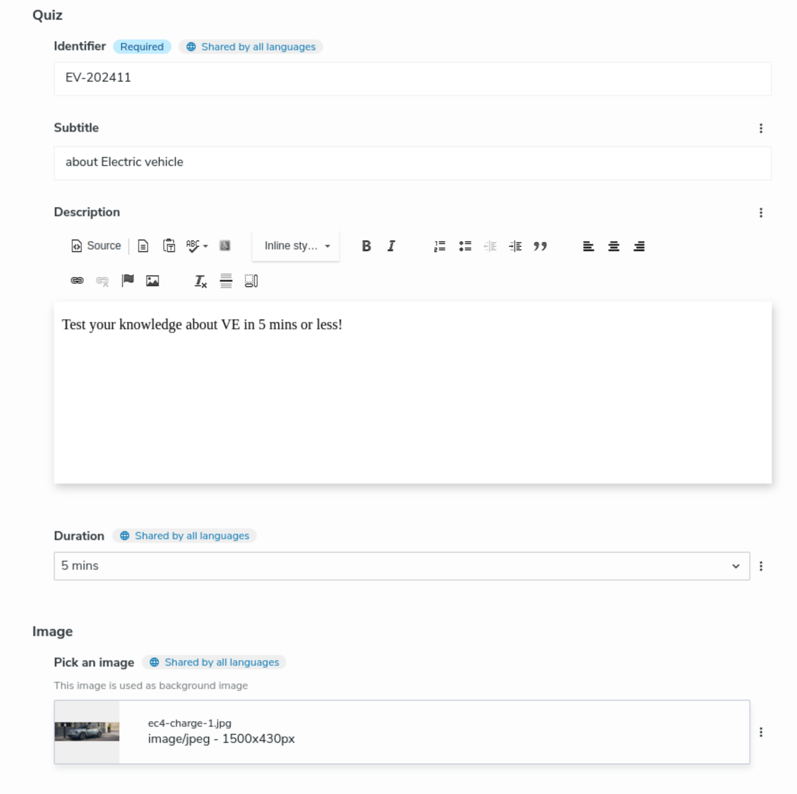
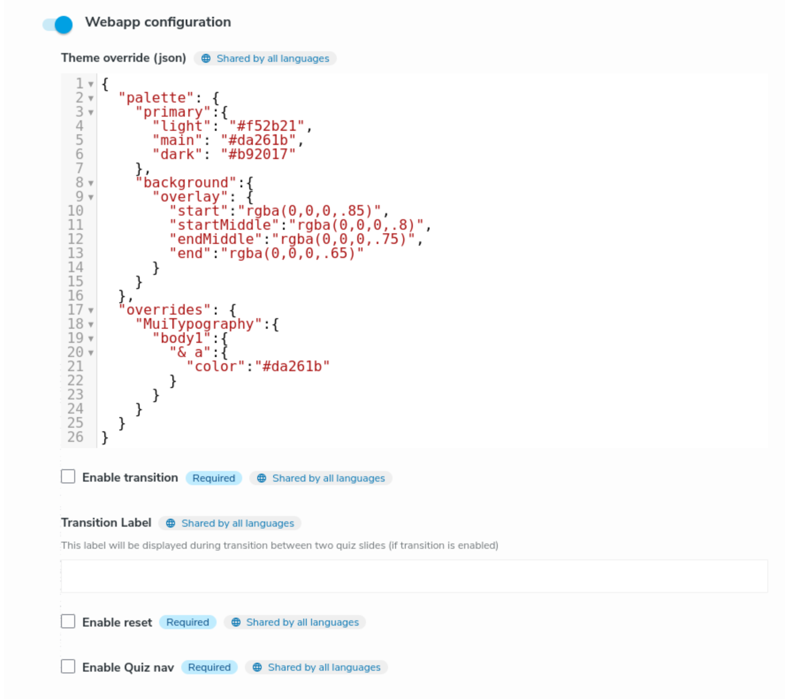
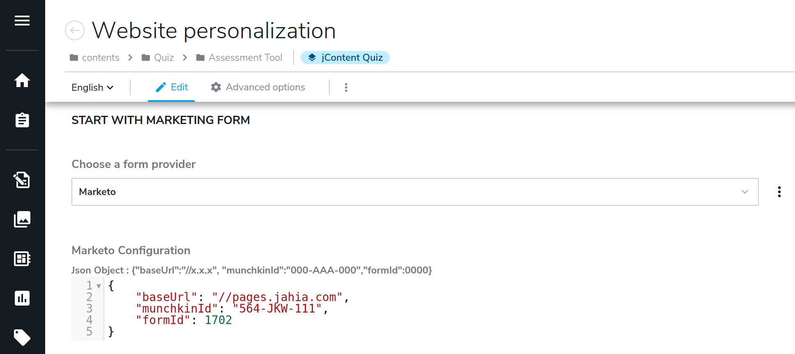
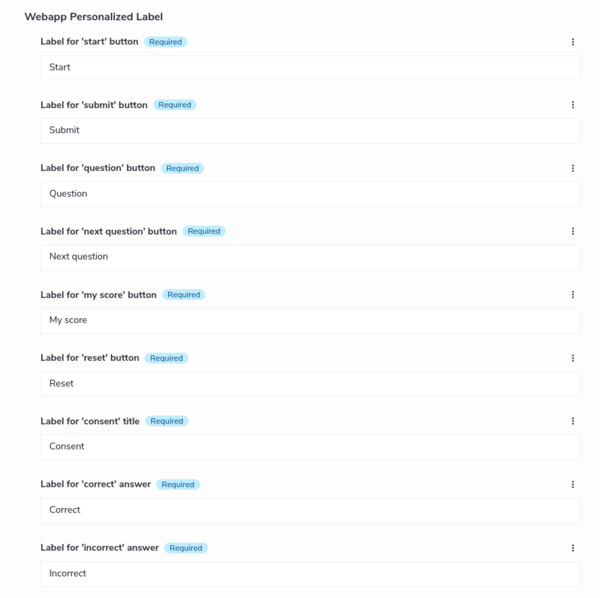
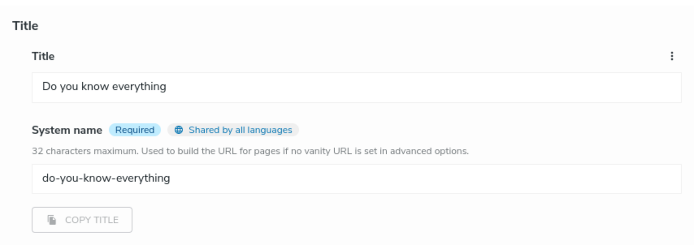
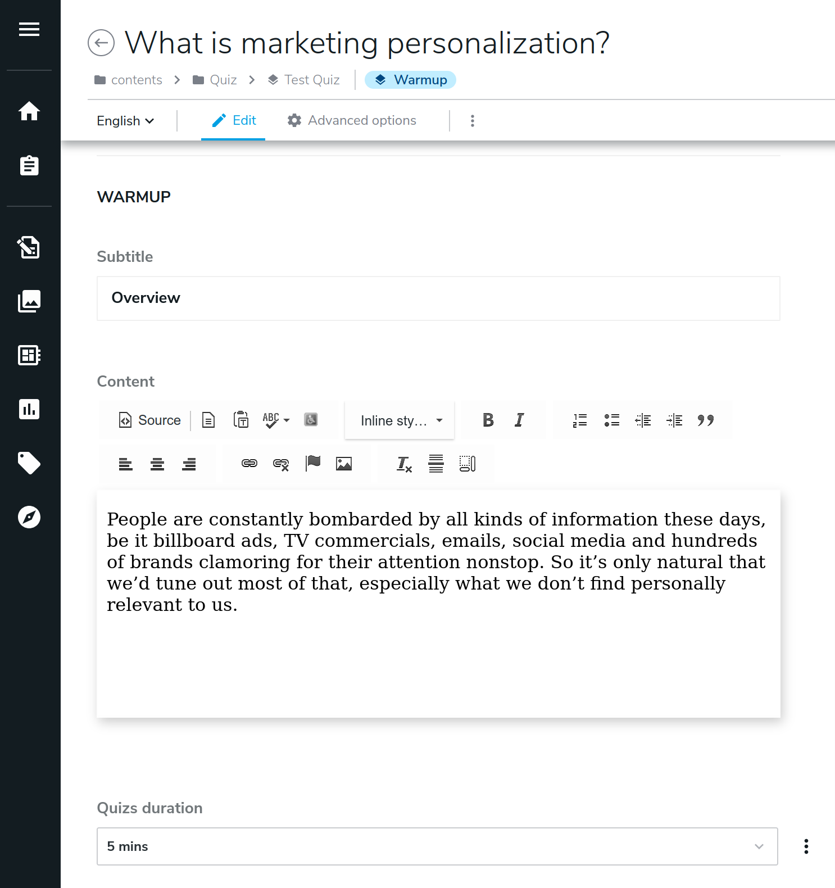
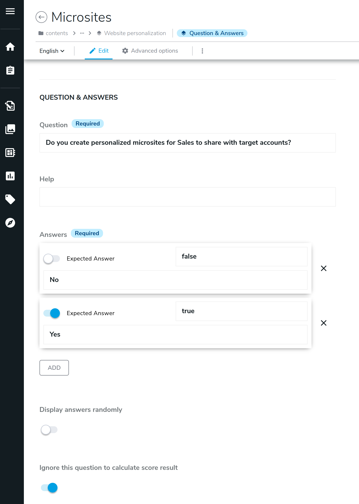
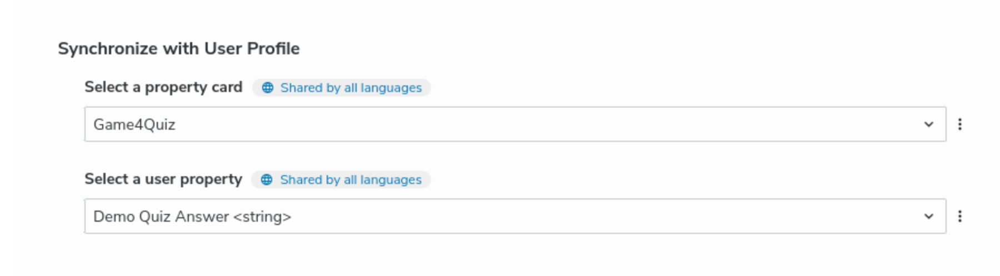
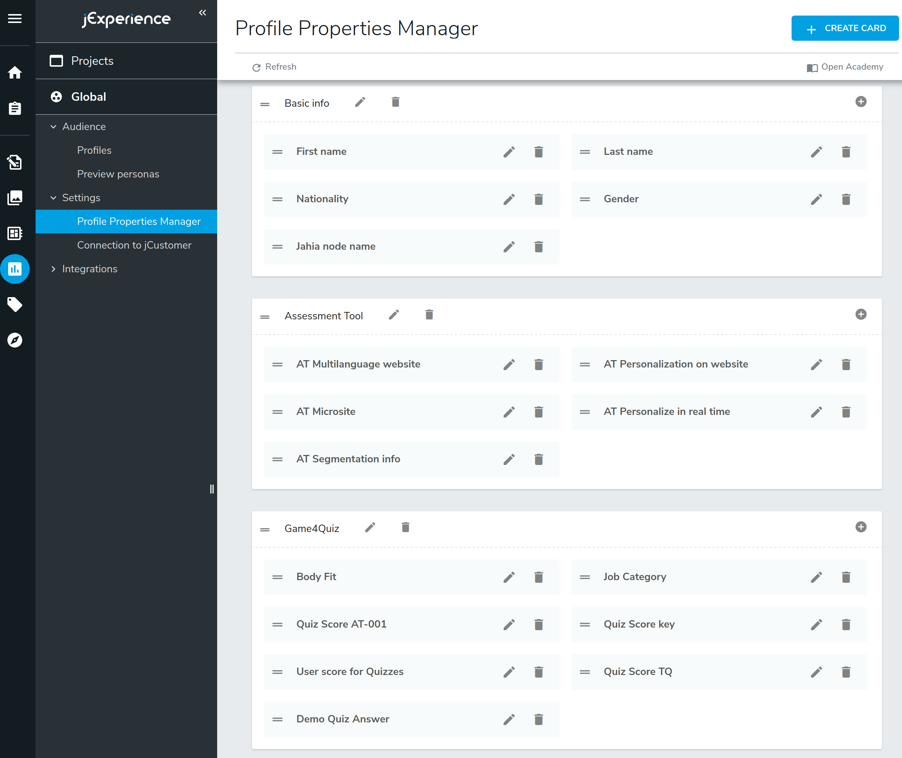

# Quiz experience (quiz-4-jahia)

The Jahia Quiz Module is an extension for the Jahia Digital Experience Platform (DXP) that allows you to create
and manage interactive quizzes on your website. It enables content creators and marketers to engage visitors
by adding customizable quizzes, surveys, or assessments directly into web pages.
The module integrates seamlessly with Jahia's content management and personalization features, allowing you to:

- **Collect User Data**: Gather insights from user responses for analytics or to inform marketing strategies.
- **Enhance Engagement**: Increase visitor interaction and time spent on your site through interactive content.
- **Personalize Experiences**: Use quiz results to tailor content and offers to individual users, especially when
combined with Jahia's jExperience module.
- **Educational Purposes**: Provide assessments or learning tools within educational platforms or corporate training
environments.

The module supports various question types, scoring mechanisms, and can display results immediately or upon
completion of the quiz. It's a valuable tool for organizations looking to deepen user engagement and collect
actionable data within their Jahia-powered websites.

- [Module content](#module-content)
- [Node Type definitions and views](#node-type-definitions-and-views)
    - [overview](#overview)
    - [game4nt:quiz](#game4ntquiz)
        - [Definition](#definition)
        - [Mixins](#mixins)
            - [game4mix:quizConfiguration](#game4mixquizconfiguration)
            - [game4mix:marketingFormReference](#game4mixmarketingformreference)
            - [game4mix:quizStaticLabels](#game4mixquizstaticlabels)
            - [mix:title](#mixtitle)
        - [Views](#views)
            - [The default view](#the-default-view)
            - [The content view](#the-content-view)
    - [game4nt:warmup](#game4ntwarmup)
        - [Definition](#definition-1)
    - [game4nt:qna](#game4ntqna)
        - [Definition](#definition-2)
        - [Mixins](#mixins-1)
            - [seumix:mapJExpProperty](#seumixmapjexpproperty)
    - [game4nt:quizReference](#game4ntquizreference)
        - [Definition](#definition-3)
## Module content

This module is used to configure Jahia as a backend of the Quiz React webapp.
Also, it contains :
* The content definition of **Quiz**, **Warmup** (personalized or not), **Question & Answer** (personalized or not),
  and **Quiz Reference** (see the [definitions.cnd] file.), and the JSON
  **selectorType configurations** (see [the folder][selector_conf]).
* A **custom selectorType** ([QnAJson]) used to manage 3 related properties and store
  the result as a JSON into a Jahia String property.
* **Views** for **Quiz** (see [quiz views folder][quizViews]),
  and **Quiz Reference** (see [quiz reference views folder][quizRefViews]).
  Note, the default view for the Quiz embed the Quiz React webapp code.
* The build of the **Quiz React webapp** (see [the folder][quiz_webapp])
* A **drools rule** (see [the code][d_rule]) which create automatically a jExperience user profile based
  on the quiz key. This property is used to store the score that a user obtains
  at the end of a quiz. Then marketeers can create personalization rule based
  on this score to personalize the content displayed to the user.

  This rule calls the java class [ScoreAsUserProperty].
* A set of **configuration files for jExperience** to create automatically
  user profile properties and rules (see [the folder][jExp_conf])

## Node Type definitions and views
One feature of this module is to be **Contributor oriented**. That means,
the Quiz webapp must be fully editable and configurable from the jContent UI.
The marketeer must be able to create at least a Quiz content and its related children
like a Warmup content or a Question & Answer content (QnA). Moreover, they must also be able to translate
these contents, to order them, to remove one of them and more.
But to be really contributor oriented, the marketeer must also be able to :
* Override the static labels used in the application (like "start" button).
* Enable a marketo form before to start the quiz.
* Synchronize user response with the CDP jExperience.
* Use a personalized content to present user results.
* Enable/disable transition between slides.
* Override some part of the application `theme`.

All of these requirements can be achieved with a well configured Jahia backend.

### overview
The nodeTypes and mixins written in the [definitions.cnd] file are defined to create the best Jahia
backend.
The main goal of this module is to create Quizzes and a quiz (`game4nt:quiz`) has two types of children:
1. Warmup (`game4nt:warmup`) used to introduce a set of QnA. A warmup can display a text or a video to provide information
   or to introduce the context of coming questions.
2. QnA (`game4nt:qna`) used to ask a question and to display a set of responses.

The hierarchy between the mixins and node types is presented in the schema below:


### game4nt:quiz
This nodeType is the main entry of a Quiz and the only content type a user can create directly in jContent.
The nodeType definition is used by jContent to create the editorial form. As presented in the
following image, properties like quizkey, Subtitle, Description, Duration and a Personalized
Result page are defined at the Quiz level (JCONTENT QUIZ section).



The nodeType support also other properties which are provided by mixins

#### Definition
This node type is defined as follows:
```cnd
[game4nt:quiz] > jnt:content, jmix:mainResource, game4mix:components, game4mix:showInTree, game4mix:imageReference, game4mix:marketingFormReference, mix:title, game4mix:quizStaticLabels
 orderable
 - game4:quizKey (string) primary mandatory fulltextsearchable=no
 - game4:subtitle (string) internationalized
 - game4:description (string, richtext[ckeditor.toolbar='Tinny',ckeditor.customConfig='$context/modules/quiz-4-jahia/javascript/ckeditor/config/small.js']) internationalized
 - game4:duration (string,choicelist[resourceBundle]) = '5 mins' autocreated indexed=no < '5 mins', '10 mins', '30 mins', '1h' , '> 1h'
 + * (game4mix:quizChild)
```

To be flexible and to have the capability to add Warmup and QnA in the order we want and
in the quantity we want, we use the mixin `game4mix:quizChild` as child type.

`game4nt:quiz` extends 1 supertype:
1. `jnt:content` meaning the node type is a content node type.

`game4nt:quiz` is extended by 8 mixins:
1. `game4mix:components` meaning the node type appears in the **Game Center** menu entry.
   This mixin is defined in the core module.
2. `jmix:mainResource` meaning the quiz is indexed by Augmented search and can be display with a content template.
3. `game4mix:showInTree` meaning the node is visible in the jContent tree
4. `game4mix:imageReference` meaning the contributor can select a background for the Quiz 'slide' coming
   from jContent Media repository or from Dam provider if the contributor has an appropriate licence.
5. `game4mix:quizConfiguration` meaning the contributor can configure the behavior of some part
   of the Quiz.
6. `game4mix:marketingFormReference` meaning the contributor can select a marketing form provider
   to expose a form in the first slide of the Quiz. Currently, the accelerator is configured with Marketo
   only.
7. `mix:title` meaning the contributor will have a **title** property which will be automatically
      sync with the System name field.
8. `game4mix:quizStaticLabels` meaning the contributor can update and translate the "static" content
   used in the Quiz, mostly buttons label.


#### Mixins

##### game4mix:quizConfiguration
This mixin add the section **WEBAPP CONFIGURATION** in the Quiz edit form
as presented in the following image.



This mixin is defined as follows in the [definitions.cnd]:
```cnd
[game4mix:quizConfiguration] mixin
 extends = game4nt:quiz
 itemtype = content
 - game4:webappTheme (string) = resourceBundle('config.webappTheme') indexed=no
 - game4:transition (boolean) = false autocreated mandatory indexed=no
 - game4:transitionLabel (string) indexed=no
 - game4:reset (boolean) = false autocreated mandatory indexed=no
 - game4:browsing (boolean) = false autocreated mandatory indexed=no
```
This mixin adds properties in the nodeType using it. These properties allow a contributor to :
* change the css theme
* enable/disable transition between slide and write a message to display during transition
* enable/disable the reset button
* enable/disable the browsing from the progress bar

<u>For the theme</u> you can overwrite all the properties used in the [theme.js] file and the default
provided by the [default Mui theme][Mui_theme].
In the image above, we overwrite the **primary** color and the default color of anchor HTML tag in
accordance.

To change the opacity of the background overlay you have to play with the `background`:`overlay`
properties in the `pallette`. Then, this json looks like this:
```json
{
  "palette": {
    "primary":{
      "light": "#f57c30",
      "main": "#e57834",
      "dark": "#bd5715"
    },
    "background":{
      "overlay": {
        "start":"rgba(0,0,0,.85)",
        "startMiddle":"rgba(0,0,0,.8)",
        "endMiddle":"rgba(0,0,0,.75)",
        "end":"rgba(0,0,0,.65)"
      }
    }
  },
  "overrides": {
    "MuiTypography":{
      "body1":{
        "& a":{
          "color":"#e57834"
        }
      }
    }
  }
}
```

##### game4mix:marketingFormReference
This mixin add the section **START WITH MARKETING FORM** in the Quiz edit form
as presented in the following image.



This mixin is defined as follows in the [definitions.cnd] file:
```cnd
[game4mix:marketingFormReference] mixin
 - game4:marketingFormChoice (string) indexed=no
```
The mixin adds the property `game4:marketingFormChoice` in the nodeType using it. This property
is a string, and it will use a **Choicelist** as selectorType in the form. The selectorType
is defined as follows in the [game4mix_marketingFormReference.json][s_marketingFormRef] file:
```json
{
  "name": "game4mix:marketingFormReference",
  "description": "",
  "dynamic": false,
  "fields": [
    {
      "name": "game4:marketingFormChoice",
      "selectorType": "Choicelist",
      "valueConstraints": [
        {
          "value": {
            "type": "String",
            "value": "mkto"
          },
          "displayValue": "Marketo",
          "propertyList": [
            {
              "name": "addMixin",
              "value": "game4mix:mktoForm"
            }
          ]
        }
      ]
    }
  ]
}
```
The selectorType, configured above, create a choiceList with one entry. The entry label is **Marketo**
the value saved when selected is **mkto** and when the value is selected we add the mixin `game4mix:mktoForm`
to the current content (in our case the quiz).

The mixin `game4mix:mktoForm` is defined as follows in the [definitions.cnd] file:

```cnd
[game4mix:mktoForm] > jmix:dynamicFieldset mixin
 extends = game4mix:marketingFormReference
 - game4:mktoConfig (string) internationalized fulltextsearchable=no
```
The mixin adds the property `game4:mktoConfig` in the nodeType using it. This property
is a string, and it will use the **CodeMirror** editor as selectorType in the form. The selectorType
is defined as follows in the [game4mix_mktoForm.json][s_mktoForm] file:

```json
{
  "name": "game4mix:mktoForm",
  "fields": [
    {
      "name": "game4:mktoConfig",
      "selectorType": "CodeMirror",
      "selectorOptions":[
        {
          "name": "mode",
          "value" : "javascript"
        }
      ]
    }
  ]
}
```
>The CodeMirror editor is custom module, developed to enhance the default capabilities of the

##### game4mix:quizStaticLabels
This mixin add the section **REACT PERSONALIZED LABEL** in the Quiz edit form
as presented in the following image.



This mixin is defined as follows in the [definitions.cnd] file:
```cnd
[game4mix:quizStaticLabels] mixin
 - game4:btnStart (string) = resourceBundle('label.game4_btnStart') autocreated internationalized mandatory indexed=no
 - game4:btnSubmit (string) = resourceBundle('label.game4_btnSubmit') autocreated internationalized mandatory indexed=no
 - game4:btnQuestion (string) = resourceBundle('label.game4_btnQuestion') autocreated internationalized mandatory indexed=no
 - game4:btnNextQuestion (string) = resourceBundle('label.game4_btnNextQuestion') autocreated internationalized mandatory indexed=no
 - game4:btnShowResults (string) = resourceBundle('label.game4_btnShowResults') autocreated internationalized mandatory indexed=no
 - game4:btnReset (string) = resourceBundle('label.game4_btnReset') autocreated internationalized mandatory indexed=no
 - game4:consentTitle (string) = resourceBundle('label.game4_consentTitle') autocreated internationalized mandatory indexed=no
 - game4:correctAnswer (string) = resourceBundle('label.game4_correctAnswer') autocreated internationalized mandatory indexed=no
 - game4:wrongAnswer (string) = resourceBundle('label.game4_wrongAnswer') autocreated internationalized mandatory indexed=no
```

The mixin adds a set of properties used to overwrite/translate the default labels defined for
the buttons. When a quiz is created, all these properties are filled with the default values written
in the appropriate resource bundle (by default there is one for [english][resource_bundle]
and one for [french][fr_bundle]).

```properties
label.game4_btnStart=Start
label.game4_btnSubmit=Submit
label.game4_btnQuestion=Question
label.game4_btnNextQuestion=Next question
label.game4_btnShowResults=My score
label.game4_btnReset=Reset
label.game4_consentTitle=Consent
label.game4_correctAnswer=Correct
label.game4_wrongAnswer=Incorrect
```

##### mix:title
This mixin add the section *TITLE** in the Quiz edit form
as presented in the following image.



#### Views
This module provides two views for a Quiz, the [default][quiz_default] and the [content][quiz_content].

##### The default view
The [default][quiz_default] view is used to display the Quiz with the React webapp.

![100]

Thus, the view can be divided in three parts :
* Part 1: Embeds the build of the Quiz React webapp from the [css] and [javascript] directory.
  ```jsp
  <template:addResources type="css" resources="webapp/${requestScope.webappCssFileName}" media="screen"/>
  <template:addResources type="javascript" resources="webapp/${requestScope.webappJsFileName}"/>
  ```
  a [RenderFilter][WebappNameFilter] is provided to get dynamically the name of the main js file name of the webapp.
  Thus, when a new release of the webapp is provided, you don't need to update the view to change the import.
* Part 2: Add an HTML tag with a unique id to hook the webapp.
  ```jsp
  <div id="${targetId}"></div>
  ```
* Part 3: Write a minimal javascript object to configure the webapp and run it.
  ```jsp
  <script>
    const quiz_context_${targetId}={
        host:"${host}",
        workspace:"${workspace}",
        isEdit:${isEdit},
        scope:"${site}",//site key
        locale:"${language}",
        quizId:"${_uuid_}",
        gqlServerUrl:"${host}/modules/graphql",
        contextServerUrl:window.digitalData?window.digitalData.contextServerPublicUrl:undefined,//digitalData is set in live mode only
    };

    window.addEventListener("DOMContentLoaded", (event) => {
        //in case if edit mode slow down the load waiting for the jahia GWT UI was setup,
        // otherwise the react app failed (maybe loosing his position as the DOM is updated by the jahia UI at the same time)
        <c:choose>
            <c:when test="${isEdit}" >
            setTimeout(() => {
                window.quizUIApp("${targetId}",quiz_context_${targetId});
            },500);
            </c:when>
            <c:otherwise>
            window.quizUIApp("${targetId}",quiz_context_${targetId});
            </c:otherwise>
        </c:choose>
    });
    ...
  <script>
  ```
##### The content view
The [content][quiz_content] view is used to display the Quiz as an HTML card. It is an example
of usual rendering in Jahia.

Below an example of the view. Clicking the "Read more" button displays the Quiz as main
content using the default view.

![501]

> As you can see in the image above, even if the content is the same, the presentation is
completely different of the one in the default view. The language to render the Quiz is also
different Javascript/HTML vs jsp/HTML

### game4nt:warmup
This nodeType can be created only as a child of a Quiz. A warmup is used to introduce a set of QnA.
A warmup display a text or a video to provide information or to introduce the context
of coming set of questions. A Warmup can have its own set of questions.



Render in the React webapp the Warmup looks like this:

![120]


The nodeType support also other properties which are provided by mixins

#### Definition
This node type is defined as follows:
```cnd
[game4nt:warmup] > jnt:content, game4mix:showInTree, game4mix:quizChild, game4mix:mediaReference, mix:title
 orderable
 - game4:subtitle (string) internationalized
 - game4:content (string, richtext[ckeditor.toolbar='Tinny',ckeditor.customConfig='$context/modules/quiz-4-jahia/javascript/ckeditor/config/small.js']) internationalized
 - game4:qnaDuration (string,choicelist[resourceBundle]) = '5 mins' autocreated indexed=no < '5 mins', '10 mins', '30 mins', '1h' , '> 1h'
 + * (game4mix:warmupChild)
```

`game4nt:warmup` extends 1 supertype:
1. `jnt:content` meaning the node type is a content node type.

`game4nt:warmup` is extended by 4 mixins:
1. `game4mix:showInTree` meaning the node is visible in the jContent tree.
2. `game4mix:quizChild` meaning the node can be child of a Quiz.
3. `game4mix:mediaReference` meaning the contributor can select an internal video from Jahia or a Dam,
   or copy past an external URL. The contributor can also select a background for the Warmup 'slide'.
4. `mix:title` meaning the contributor will have a **title** property which will be automatically
   sync with the System name field, see the [mix:title](#mixtitle) section.

### game4nt:qna
This nodeType can be created as a child of a Quiz or a Warmup. A Question and Answer (QnA)
is used to write question and the possible answer. A QnA can be used to test the maturity
of a visitor on a subject and/or to get used data based on visitor answers.

A QnA displays a question, an optional help message and a set of responses. Answers can be
displayed in a random order and the response can be ignored to calculate the final score.



> A specific selectorType named [QnAJson] is used to contribute the answer. It allows contributor
> to fill 3 props at a time : (i) is the expected answer, (ii) value to store in jExperience, (iii) text of the answer

Render in the React webapp the QnA looks like this:

![1112]

The nodeType support also other properties which are provided by mixins

#### Definition
This node type is defined as follows:
```cnd
[game4nt:qna] > jnt:content, game4mix:showInTree, seumix:mapJExpProperty, game4mix:imageReference, game4mix:quizChild,game4mix:warmupChild, mix:title
 - game4:question (string) mandatory internationalized
 - game4:help (string) internationalized
 - game4:answers (string) mandatory multiple internationalized indexed=no
 - game4:randomSelection (boolean) = false autocreated indexed=no
 - game4:notUsedForScore (boolean) indexed=no
```

`game4nt:qna` extends 1 supertype:
1. `jnt:content` meaning the node type is a content node type.

`game4nt:warmup` is extended by 4 mixins:
1. `game4mix:showInTree` meaning the node is visible in the jContent tree.
2. `seumix:mapJExpProperty` meaning the contributor can map and store the response of the visitor to a jExperience user profile
property.
3. `game4mix:imageReference` meaning the contributor can select a background for the Quiz 'slide' coming
      from jContent Media repository or from Dam if the contributor has an appropriate licence.
4. `game4mix:quizChild` meaning the node can be child of a Quiz.
5. `game4mix:warmupChild` meaning this content can be a child node of a warmup.
6. `mix:title` meaning the contributor will have a **title** property which will be automatically
   sync with the System name field, see the [mix:title](#mixtitle) section.

#### Mixins
##### seumix:mapJExpProperty
This mixin adds the sections **Synchronize with User Profile** in the QnA
edit form as presented in the following images.



This mixin is defined in the module [se-jExp-utils]:
```cnd
[seumix:mapJExpProperty] mixin
 - seu:jExpCard (string, choicelist[seUtilsJExpProfileCardsInitializer,resourceBundle]) indexed=no
 - seu:jExpProperty (string, choicelist[seUtilsJExpProfilePropertiesInitializer,dependentProperties='seu:jExpCard',resourceBundle]) indexed=no
```
This mixin adds, to the nodeType using it, two properties with a `choiceList selectorType`.

There is a dependency between the value selected in `seu:jExpCard` and the values displayed
in the choiceList of `seu:jExpProperty`.

Indeed, only the properties of the cards are displayed in the property selector.
These choiceLists are populated by custom initializers, respectively [JExpProfileCardsInitializer]
and [JExpProfilePropertiesInitializer].

The values are the same as the ones configured in the jExperience Profile Properties Manager.



### game4nt:quizReference
This nodeType is used to create a Quiz reference in the Page Composer interface.


#### Definition
This node type is defined as follows:
```cnd
[game4nt:quizReference] > jnt:content,jmix:nodeReference, game4mix:components
 - j:node (weakreference) < 'game4nt:quiz'
```
`game4nt:quizReference` extends 1 supertypes:
1. `jnt:content` meaning the node type is a content node type.

`game4nt:quizReference` is extended by 2 mixins:
1. `jmix:nodeReference` meaning the node is like a *wrapper* used to reference a Quiz node.
   This mixin provides a default attribute `j:node` used to store the path of the referenced node.
2. `game4mix:components` meaning the node type appears in the **Game Center** menu entry.
   This mixin is defined in the core module.


>In this definition, the property `j:node` is overwritten. Indeed, we want to restrict the allowed
> node type to be picked to the node type `game4nt:quiz`.


[020]: ./doc/images/020_webAppConfig.png

[100]: ./doc/images/100_quizHome.png
[120]: ./doc/images/120_warmup.png
[1112]: ./doc/images/111_qnaAnswered2.png
[501]: ./doc/images/501_viewContent.png

[overview.md]: ../README.md
[definitions.cnd]: ./src/main/resources/META-INF/definitions.cnd
[quizViews]: ./src/main/resources/game4nt_quiz/html
[quizRefViews]: ./src/main/resources/game4nt_quizReference/html
[WebappNameFilter]: ./src/main/java/org/jahia/se/modules/quiz/webapp/WebappNameFilter.java
[d_rule]: ./src/main/resources/META-INF/rules.drl
[quiz_webapp]: ./src/main/resources/javascript/webapp
[QnAJson]: ./src/javascript/QnAJson
[jExp_conf]: ./src/main/resources/META-INF/jexperience
[selector_conf]:  ./src/main/resources/META-INF/jahia-content-editor-forms/fieldsets
[theme.js]: https://github.com/Jahia/quiz-4-jahia-webapp/blob/main/src/components/theme.js
[Mui_theme]: https://material-ui.com/customization/default-theme
[se-jExp-utils]: https://github.com/Jahia/se-jExp-utils
[resource_bundle]: ./src/main/resources/resources/quiz-4-jahia.properties
[fr_bundle]: ./src/main/resources/resources/quiz-4-jahia_fr.properties
[ScoreAsUserProperty]: ./src/main/java/org/jahia/se/modules/quiz/rules/ScoreAsUserProperty.java

[s_marketingFormRef]: ./src/main/resources/META-INF/jahia-content-editor-forms/fieldsets/game4mix_marketingFormReference.json
[s_mktoForm]:./src/main/resources/META-INF/jahia-content-editor-forms/fieldsets/game4mix_mktoForm.json

[JExpProfileCardsInitializer]: https://github.com/Jahia/se-jExp-utils/blob/main/src/main/java/org/jahia/se/modules/utils/initializers/jExperience/JExpProfileCardsInitializer.java
[JExpProfilePropertiesInitializer]: https://github.com/Jahia/se-jExp-utils/blob/main/src/main/java/org/jahia/se/modules/utils/initializers/jExperience/JExpProfilePropertiesInitializer.java

[quiz_default]: ./src/main/resources/game4nt_quiz/html/quiz.jsp
[quiz_content]: ./src/main/resources/game4nt_quiz/html/quiz.content.jsp
[css]: ./src/main/resources/css
[javascript]: ./src/main/resources/javascript
